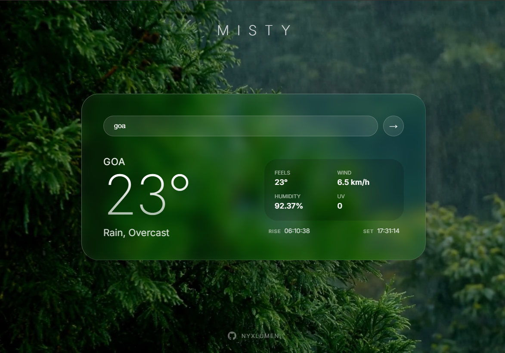

# 🌫️ Misty

**Misty is a calm, animated weather interface that reacts to real-time sky conditions.**  
Instead of just showing numbers, it changes the entire atmosphere around you.

Built as part of my journey through **The Odin Project**, Misty explores how web apps can _feel_ not just function.

<p align="center">
  
</p>

## ✨ Features

- Live weather data via Visual Crossing API
- Animated sky backgrounds that change based on real weather
- Smooth cross-fade sky transitions
- Liquid glass (glassmorphism) UI
- Clean, cozy, minimal interface
- Fully responsive
- Optimized animated sky system

## 🧠 Tech Stack

- Vanilla JavaScript
- Vite
- Visual Crossing Weather API
- HTML / CSS

## 📦 Local Setup

```bash
git clone https://github.com/YOURUSERNAME/Misty.git
cd Misty
npm install
npm run dev
```
